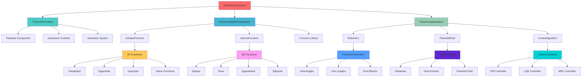
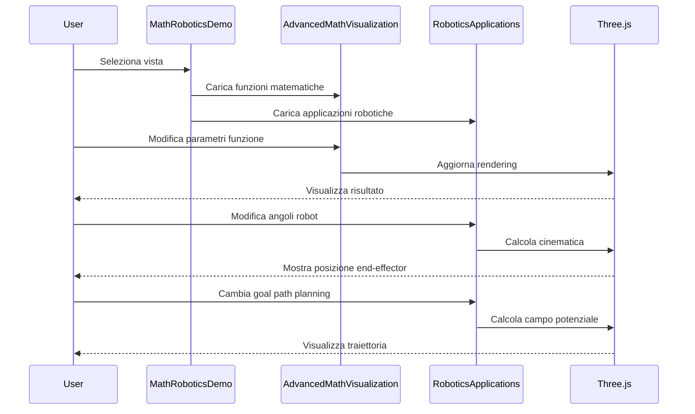
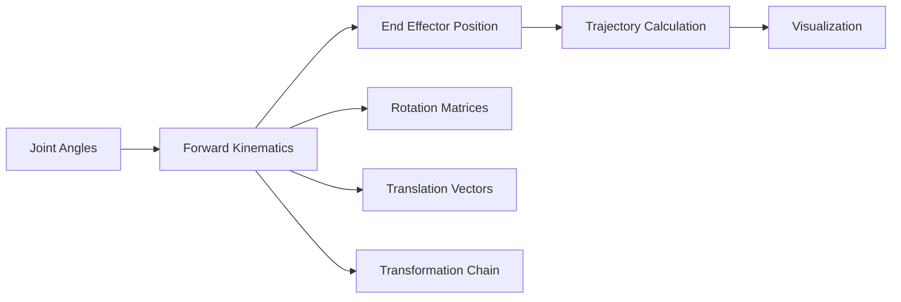
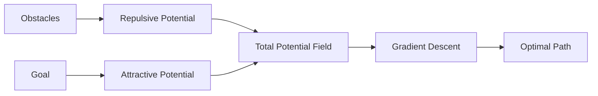
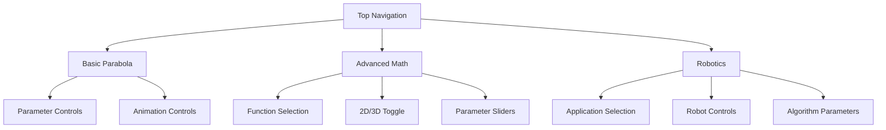
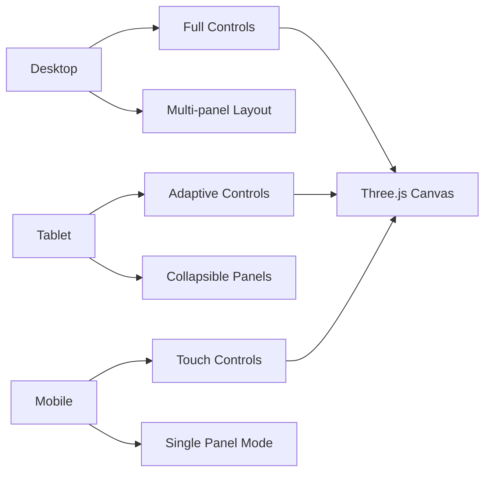
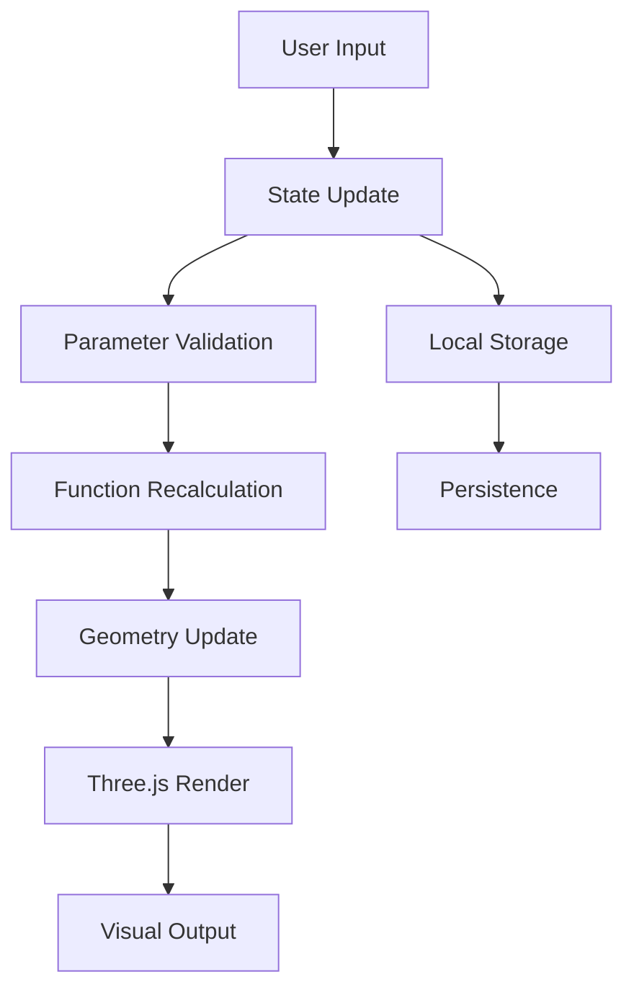
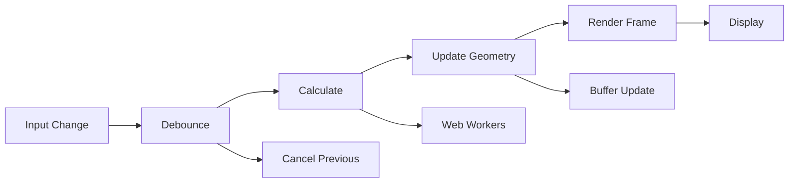
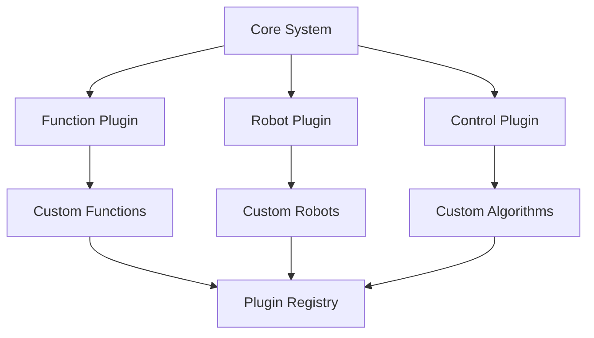

# 🏗️ Architettura Sistema Matematica e Robotica

## 📊 Diagramma Architetturale



## 🔧 Componenti Tecnici

### Core Components
- **MathRoboticsDemo**: Componente principale con navigazione
- **ThreeJSAnimation**: Visualizzazione parabola base
- **AdvancedMathVisualization**: Funzioni matematiche avanzate
- **RoboticsApplications**: Applicazioni robotiche

### Mathematical Functions
- **SurfaceFunction**: Rendering superfici 2D
- **VolumeFunction**: Rendering volumi 3D
- **Function Library**: Libreria funzioni matematiche

### Robotics Components
- **RobotArm**: Braccio robotico con cinematica
- **PotentialField**: Campo di potenziale per path planning
- **ControlAlgorithm**: Algoritmi di controllo

## 🎯 Flusso Dati



## 🧮 Algoritmi Implementati

### Funzioni Matematiche
```mermaid
graph LR
    A[Input Parameters] --> B[Function Evaluation]
    B --> C[Point Generation]
    C --> D[Geometry Creation]
    D --> E[Three.js Rendering]
    
    B --> B1[2D: z = f(x,y)]
    B --> B2[3D: w = f(x,y,z)]
    
    C --> C1[Surface Points]
    C --> C2[Volume Points]
    C --> C3[Color Mapping]
```

### Cinematica Robotica


### Path Planning


## 🎮 Interfaccia Utente

### Navigation System


### Control Panels
- **Function Panel**: Selezione e parametri funzioni
- **Robot Panel**: Controlli cinematica e path planning
- **Info Panel**: Informazioni tecniche e didattiche
- **Settings Panel**: Configurazioni avanzate

## 📱 Responsive Design



## 🔄 State Management

### Component State
```typescript
interface MathRoboticsState {
  currentView: 'basic' | 'advanced' | 'robotics';
  selectedFunction: string;
  parameters: {
    a: number;
    b: number;
    c: number;
    resolution: number;
    range: number;
  };
  robotConfig: {
    jointAngles: number[];
    linkLengths: number[];
    obstacles: Obstacle[];
    goal: Position;
  };
  controlParams: {
    algorithm: 'PID' | 'LQR' | 'MPC';
    kp: number;
    ki: number;
    kd: number;
  };
}
```

### Data Flow


## 🚀 Performance Optimization

### Rendering Pipeline


### Memory Management
- **Geometry Reuse**: Riutilizzo geometrie esistenti
- **Buffer Optimization**: Aggiornamento efficiente buffer
- **Garbage Collection**: Pulizia automatica oggetti
- **Lazy Loading**: Caricamento on-demand componenti

## 🔧 Estensibilità

### Plugin System


### API Design
```typescript
interface FunctionPlugin {
  name: string;
  description: string;
  evaluate: (x: number, y: number, z?: number) => number;
  parameters: ParameterDefinition[];
  visualization: VisualizationConfig;
}

interface RobotPlugin {
  name: string;
  description: string;
  kinematics: KinematicsConfig;
  dynamics: DynamicsConfig;
  visualization: RobotVisualization;
}
```

## 📊 Monitoring e Analytics

### Performance Metrics
- **FPS**: Frame rate rendering
- **Memory**: Utilizzo memoria
- **CPU**: Utilizzo processore
- **GPU**: Utilizzo scheda grafica

### User Analytics
- **Function Usage**: Funzioni più utilizzate
- **Parameter Ranges**: Range parametri comuni
- **Session Duration**: Durata sessioni
- **Error Tracking**: Errori e crash

---

**Architettura progettata per scalabilità, performance e usabilità**
